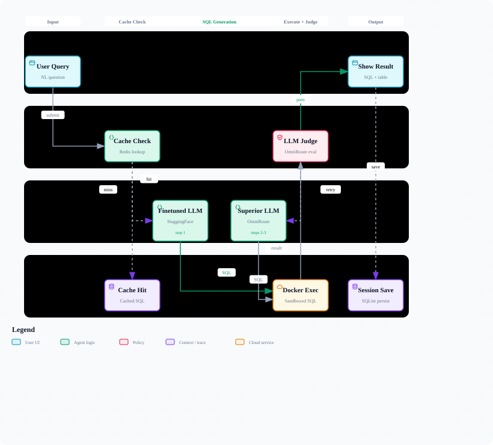

<div align="center">

# NL2SQL CLI

**Agentic natural language → SQL with self-correcting generation, LLM-as-judge evaluation, and Docker-sandboxed execution.**

[](https://python.org)
[](LICENSE)
[](https://textual.textualize.io)

</div>

---

## What it does

NL2SQL CLI converts plain-English questions into SQL queries against a local SQLite database. It runs a multi-step agentic loop: try a cheap finetuned model first, validate the result in an isolated Docker container, let an LLM judge score it, and — only on failure — escalate to a more capable model with full error context fed back. Optional Redis caching and Langfuse tracing slot in without changing the core path.

```
$ nl2sql query "How many users signed up last month?"

▶ Step 1 (finetuned) – generating…
  ✓ SQL:  SELECT COUNT(*) FROM users WHERE created_at >= date('now','-1 month')
▶ Executing in Docker sandbox…
  ✓ Result: 1 row
▶ Judge verdict: PASS (score 9/10)

┌──────────┐
│ COUNT(*) │
├──────────┤
│   2 841  │
└──────────┘
```

---

## System Architecture


> Interactive version with pan/zoom, search, and dark mode: [`docs/architecture.html`](docs/architecture.html)

---

## Query Execution Flow



> Interactive version: [`docs/workflow.html`](docs/workflow.html)

---

## Components

| Module | File | Role |
|---|---|---|
| **CLI Entry** | `nl2sql/cli.py` | Click group: launches TUI by default; exposes `init`, `query`, `status` |
| **Config** | `nl2sql/core/config.py` | Walks cwd → git root → `$HOME` for `.env`; builds a typed `Config` dataclass |
| **Textual TUI** | `nl2sql/tui/app.py` | Rich terminal UI: query input, live event log, result table, CSV export (Ctrl+E) |
| **Agentic Loop** | `nl2sql/core/engine.py` | Orchestrates generate → execute → judge with progressive model escalation |
| **LLM Client** | `nl2sql/core/llm.py` | OpenAI-compatible HTTP client; handles generation, judging, and HF warmup ping |
| **Docker Sandbox** | `nl2sql/core/sandbox.py` | Runs SQL in an isolated container against a read-only DB copy; falls back to local SQLite |
| **Session Store** | `nl2sql/core/session.py` | Saves every attempt and verdict to `~/.nl2sql/sessions.db` |
| **Worker / Cache** | `nl2sql/queue/worker.py` | Optional RQ task + Redis cache-aside; pub/sub progress for distributed use |

---

## How the Agentic Loop Works

```
Question + Schema
        │
        ▼
   Redis Cache ──hit──▶ return cached SQL
        │ miss
        ▼
 ┌─────────────────────────────────────────────────────┐
 │  Step 1  ─  Finetuned model (HuggingFace)           │
 │    Generate SQL → Execute (Docker) → Judge           │
 │    PASS ──────────────────────────────▶ done         │
 │    FAIL ──▶ capture error + SQL                     │
 │                                                     │
 │  Step 2-3  ─  Superior model (OmniRoute)            │
 │    Generate SQL (with error context) → Execute      │
 │    → Judge                                          │
 │    PASS ──────────────────────────────▶ done         │
 │    FAIL ──▶ return best attempt seen so far         │
 └─────────────────────────────────────────────────────┘
        │
        ▼
  Persist to sessions.db
  Write to Redis cache (1-hour TTL)
  Emit Langfuse span (if configured)
```

**Why two models?**  
The finetuned HuggingFace model is fast and cheap — ideal for queries it was trained on. The OmniRoute superior model handles anything novel, and receives the previous SQL and error message as context so it can self-correct rather than starting from scratch.

**Why Docker?**  
SQL execution happens inside an isolated container against a read-only copy of the database. A malformed or destructive query cannot touch the real file.

---

## Installation

```bash
pip install -e .
```

**Requirements:** Python ≥ 3.10, Docker (optional but recommended), Redis (optional).

---

## Quick Start

```bash
# 1. Write config to .env
nl2sql init --db ./my.db --schema ./schema.sql

# 2. Launch the TUI
nl2sql

# 3. Or run a one-shot query
nl2sql query "Show the top 5 products by revenue this quarter"

# 4. JSON output for scripting
nl2sql query "Total orders today" --json-output
```

---

## Configuration

All settings are read from `.env` — searched from the current directory up to `$HOME`.

```env
# ── Required ──────────────────────────────────────────
DB_PATH=./database/production.db
SCHEMA_PATH=./database/schema.sql

# ── Finetuned model (Step 1) ──────────────────────────
HF_ENDPOINT=https://your-endpoint.huggingface.cloud
HF_TOKEN=hf_xxxxxxxxxxxxxxxxxxxxxxxxxxxx

# ── Superior model (Steps 2-3 + Judge) ───────────────
OMNIROUTE_URL=https://your-omniroute-host
OMNIROUTE_GEN_MODEL=gpt-4o
OMNIROUTE_JUDGE_MODEL=gpt-4o-mini

# ── Optional: Caching ─────────────────────────────────
REDIS_URL=redis://localhost:6379        # omit to disable

# ── Optional: Observability ───────────────────────────
LANGFUSE_PUBLIC_KEY=pk-lf-...
LANGFUSE_SECRET_KEY=sk-lf-...
LANGFUSE_HOST=https://cloud.langfuse.com

# ── Tuning ────────────────────────────────────────────
MAX_FINETUNED_STEPS=1   # how many steps use the finetuned model
MAX_TOTAL_STEPS=3       # maximum retry attempts overall
```

---

## TUI Keybindings

| Key | Action |
|---|---|
| `Ctrl+N` | New session |
| `Ctrl+E` | Export results to CSV |
| `F1` | Help |
| `Ctrl+C` | Quit |

---

## Project Layout

```
nl2sql/
├── cli.py               # Click entrypoint
├── core/
│   ├── config.py        # Config loader (.env → dataclass)
│   ├── engine.py        # AgenticLoop (generate → execute → judge)
│   ├── llm.py           # LLMClient (generate_sql, judge_sql, ping)
│   ├── sandbox.py       # DockerSandbox + local SQLite fallback
│   ├── session.py       # SQLite session history
│   └── tracing.py       # Langfuse integration
├── tui/
│   ├── app.py           # Textual NL2SQLApp
│   └── dialogs/         # Help modal
└── queue/
    └── worker.py        # RQ task + Redis cache

docs/
├── architecture.json    # Archify source spec
├── architecture.html    # Interactive diagram
├── architecture.svg     # Static embed (this README)
├── workflow.json
├── workflow.html
└── workflow.svg
```

---

## Design Decisions

**Progressive escalation** — The cheap model runs first. Only a failed judge verdict triggers the expensive model, keeping inference costs low on common queries.

**Error feedback loop** — On retry, the superior model receives the previous SQL attempt and the exact execution error. This is strictly more information than a fresh prompt, and empirically leads to faster self-correction.

**Sandbox isolation** — Docker prevents any query from mutating or reading outside the intended scope. The container receives a base64-encoded SQL string, not a shell command.

**Semantic caching** — Redis caches by `hash(question + schema identifiers)`. A repeated or paraphrased question that hashes the same way returns instantly without touching the LLMs.

**Everything optional** — Docker, Redis, and Langfuse degrade gracefully: Docker falls back to local SQLite, Redis is simply skipped, Langfuse is a no-op. The core loop has no hard dependencies on any of them.

---

## License

MIT — see [LICENSE](LICENSE).
